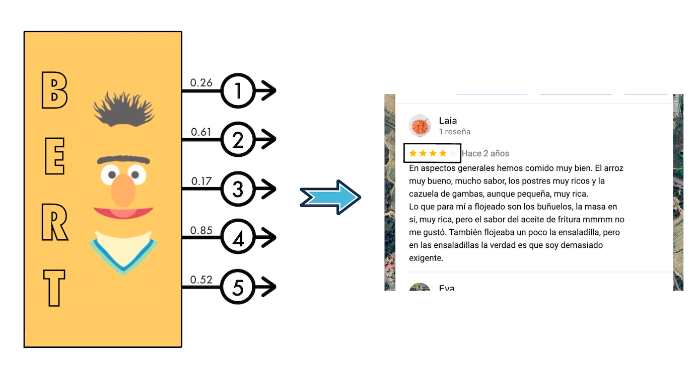

# Sentiment Analysis of Google Maps Reviews using AI Models

This project implements two AI models based on the Transformer architecture. One model is a fine-tuned BERT, while the other is an implementation of the **"Attention is All You Need"** paper. The objective of both models is to analyze the sentiment of Google Maps reviews and assign a corresponding score.

Using natural language processing **(NLP)** techniques, the model assigns a rating between 1 and 5 based on the sentiment analysis of the review, as illustrated in the image.

Finally, the accuracy of both models is compared to determine which one achieves the highest performance. The dataset used for training and evaluation was obtained through web scraping.

## Description
The goal of this project is to develop an artificial intelligence model capable of making reliable predictions based on Google Maps reviews, in order to generate a rating that more accurately reflects what the comments convey about the actual quality of the restaurant.

This project was initiated to address the issue of restaurant ratings on Google Maps. Often, when you visit a place based on its rating, you might leave feeling that the score does not truly reflect reality. Therefore, if a model could recalculate review scores while also considering how recently a review was posted, it would be possible to generate a metric that better aligns with the current state of the restaurant.

***Technologies Used***:
- Selenium: Automatically extracts restaurant data from Google Maps.
- Vue.js: Develops an interface that allows users to easily modify review ratings.
- PyTorch: Builds and trains the AI models.
- Docker: Creates a containerized environment for executing the training process.

## Directory structure
### BERT
In the BERT folder, you will find the training code for the fine-tuned BERT model, where it loads the data and the model, and processes the data for training.

The fine-tuned BERT model is a model with 12 encoder layers and four linear layers connected to the last encoder layer, where the final encoder layer outputs 5 neurons, each representing a class. The model has been trained using CrossEntropyLoss as the loss function and Adam as the optimizer. The training also includes EarlyStopping.

### MyBERT
In the BERT folder, you will find the training code for the implementation of the Transformer architecture model, where it loads the data and the model, and processes the data for training.

The myBERT model has the same features as the previous model; however, instead of having 12 encoder layers, it only has a single encoder layer. The model has been trained using CrossEntropyLoss as the loss function and Adam as the optimizer. The training also includes EarlyStopping.

### src
The Tokenizer file contains the implementation of the tokenizer adapted to the myBERT model. The tokenizer retrieves the tokens from the vocabulary generated by the code in the vocab folder and generates their respective identifiers. When processing a word vector, it transforms it into a vector of token identifiers.

The Training file contains the code related to the training of the models: loss calculation and model weight updates.

### vocab
This folder contains the code to create a token vocabulary with a maximum length from a set of texts using the WPE algorithm.

